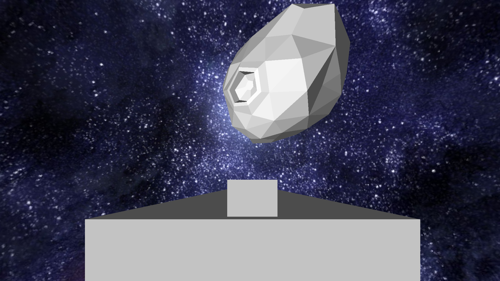
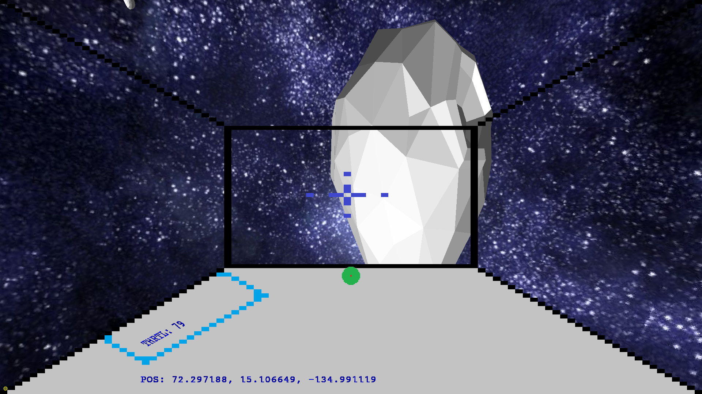

<h1> Spaceship game </h1>

A simple game. Or rather more like a tech demo for my cat game engine.

Contorlls:  
wasd - movement  
space and q for roll  
mouse for yaw and pitch  
Hold C to increase throttle X to decrease  
Z - breaks (slow down) 

Assets used:  
<a href="https://github.com/ceimerrudis/cat">Cat engine</a> 
<a href="https://poly.pizza/m/yuCzypJ0w4">Asteroid asset</a> 
<a href="https://www.pinterest.com/pin/363384263681411249/">Skybox texture (random image from pintrest)</a> 

